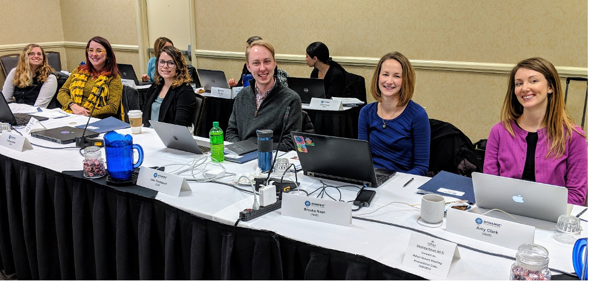
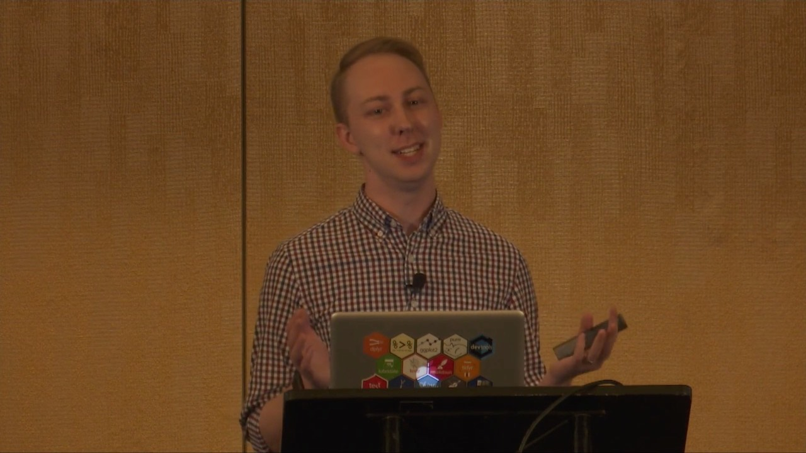
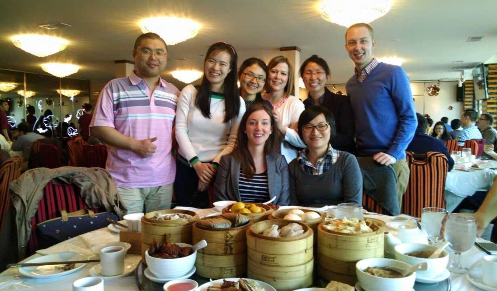

+++
# A Demo section created with the Blank widget.
# Any elements can be added in the body: https://sourcethemes.com/academic/docs/writing-markdown-latex/
# Add more sections by duplicating this file and customizing to your requirements.

widget = "blank"  # See https://sourcethemes.com/academic/docs/page-builder/
headless = true  # This file represents a page section.
active = true # Activate this widget? true/false
weight = 20  # Order that this section will appear.

title = ""
subtitle = ""

[design]
  # Choose how many columns the section has. Valid values: 1 or 2.
  columns = "1"

[design.background]
  # Apply a background color, gradient, or image.
  #   Uncomment (by removing `#`) an option to apply it.
  #   Choose a light or dark text color by setting `text_color_light`.
  #   Any HTML color name or Hex value is valid.

  # Background color.
  # color = "navy"
  
  # Background gradient.
  # gradient_start = "DeepSkyBlue"
  # gradient_end = "SkyBlue"
  
  # Background image.
  image = ""  # Name of image in `static/img/`.
  image_darken = 0.6  # Darken the image? Range 0-1 where 0 is transparent and 1 is opaque.

  # Text color (true=light or false=dark).
  text_color_light = false

[design.spacing]
  # Customize the section spacing. Order is top, right, bottom, left.
  padding = ["20px", "0", "20px", "0"]

[advanced]
 # Custom CSS. 
 css_style = ""
 
 # CSS class.
 css_class = "mini"
+++

I was born and raised in Kansas and am a proud Jayhawk. I earned both my B.Sc. in Behavioral Neuroscience and my Ph.D. in Educational Psychology at the [University of Kansas](https://www.ku.edu).
During my graduate work, I focused on educational assessment and psychometrics, following the Research, Evaluation, Measurement, and Statistics (REMS) track.
While in graduate school, I worked as a research assistant at the [Achievement and Assessment Institute](https://aai.ku.edu) (AAI).
I now work at one of the centers within AAI, [Accessible Teaching, Learning, and Assessment Systems](https://atlas.ku.edu) (ATLAS), where I am a senior psychometrician working primarily on the [Dynamic Learning Maps&reg;](https://dynamiclearningmaps.org) alternate assessment.

My [research](https://profiles.impactstory.org/u/0000-0001-7339-0300) focuses on using diagnostic classification models (DCMs) to understand how students learn, provide actionable feedback to teachers, and report meaningful measures of student achievement.
I have written numerous [publications](https://cv.wjakethompson.com/#publications) on the use of DCMs, and have presented my research at [conferences](https://cv.wjakethompson.com/#conference-presentations) across the United States and internationally. 

During my time at KU and AAI, I began using the [R programming language](https://r-project.org) as a student, researcher, and instructor.
I have developed and taught [workshops](/categories/workshop/) on how to use R to explore data, answer questions, and write reports, both generally and within the area of educational assessment.

I also write R packages to increase the accessibility of R Markdown within organizations.
The [{ratlas}](https://ratlas.netlify.app) package includes R Markdown templates and custom [{ggplot2}](https://ggplot2.tidyverse.org) themes for writing branded reports for [ATLAS](https://atlas.ku.edu).
Similarly, the [{jayhawkdown}](https://jayhawkdown.wjakethompson.com) package provides a template for writing dissertations and theses at the University of Kansas that meeting all formatting requirements.

Thanks for reading!
