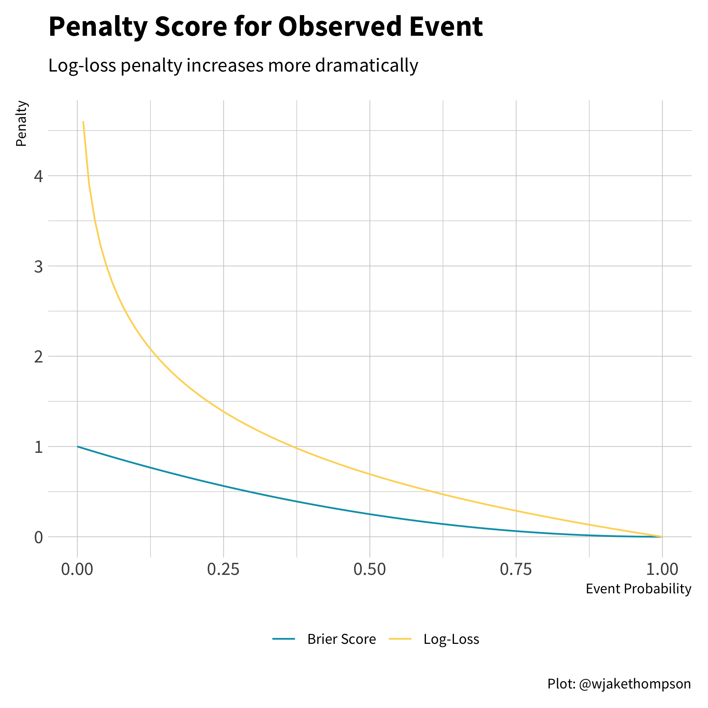

```{r setup, include = FALSE, message = FALSE}
library(tidyverse)
library(wjake)
knitr::opts_chunk$set(
  collapse = TRUE,
  message = FALSE,
  warning = FALSE,
  comment = "#>",
  echo = TRUE,
  cache = FALSE,
  fig.align = "center",
  fig.width = 8,
  fig.retina = 2,
  out.width = "70%"
)

wjake::set_theme(base_family = "Source Sans Pro",
                 plot_margin = margin(10, 10, 10, 10))
```

After two very long months, the 2020 presidential election finally comes to a close today as congress is expected to certify the electoral college results. To celebrate, I thought I'd look back at the many election forecasts we had in 2020 to see which forecast performed the best, given the results we now have. To do this, we'll look at two outcomes: prediction accuracy and model accuracy. But first, the data!

## The Forecasts

There were so. many. forecasts. I tried my best to gather as many as I could prior to election day. Ultimately, here are the forecasts I was able to pull probabilities of each candidate winning from for each state.

* [Decision Desk HQ](https://forecast.decisiondeskhq.com/president)
* [Drord Mapmaking](https://splittingamerica.neocities.org/new.html)
* [Economist](https://projects.economist.com/us-2020-forecast/president)
* [Electoral Polls](https://electoralpolls.com/)
* [FiveThirtyEight](https://projects.fivethirtyeight.com/2020-election-forecast/)
* [JHK Forecasts](https://projects.jhkforecasts.com/presidential-forecast/)
* [Lean Tossup](https://leantossup.ca/us-presidency/)
* [New Statesman](https://www.newstatesman.com/international/2020/11/us-2020-presidential-election-forecast-model-will-donald-trump-or-joe-biden)
* [Plural Vote](http://www.pluralvote.com/article/2020-forecast/)
* [PredictIt](https://www.predictit.org/markets/13/Prez-Election)
* [Princeton Election Consortium](https://election.princeton.edu/for-fellow-geeks/)
* [Progress Campaign](https://www.ourprogress.org/forecast)
* [Race to the White House](https://www.racetothewh.com/president)
* [Reed Forecasts](https://reedforecasts.com/)
* [The Cycle](https://thecycle.news/news/september-2020-election-update)

I also pulled the 2016 map to use as a baseline measure. All of the data is available in a Google sheet [here](https://docs.google.com/spreadsheets/d/1CpMPWCHLfwByucZz9fzIH8ivHnIcfmrYUjKQ1tFTbFU/). In the Google sheet, the probabilities indicate the probability that Joe Biden would win each state.

A few of the forecasts (including notably, the Economist) did not forecast the congressional districts in Nebraska and Maine separately from the whole state. Thus, for those forecasts, I used the statewide probability for each of the individual congressional districts as well, as that was the probability those forecasts assigned to each candidate for winning *all* electoral college votes from the state.

## Prediction Accuracy

We're defining prediction accuracy as how close the estimated probabilities were to the observed outcome. We can assess this through three measures: log-loss, Brier Score, and a weighted Brier Score. All of these measures evaluate how close the probability was to the observed event. The [log-loss](https://www.kaggle.com/dansbecker/what-is-log-loss) is very common classification metric and is defined as

$$\begin{equation}
  \text{Log-Loss}=-\frac{1}{P}\sum_{i=1}^Py_i\log(\hat{y}_i) + (1 - y_i)\log(1-\hat{y}_i)
  (\#eq:logloss)
\end{equation}$$

In Equation \@ref(eq:logloss), $P$ is the total number of predictions, $y_i$ is the observed outcome (i.e., 0 or 1), and $\hat{y}_i$ is the estimated probability of the event occurring. When the event occurs (i.e., $y_i = 1$), we add the log of the probability of the event in our sum. Conversely, when the event doesn't occur (i.e., $y_i = 0$) we add the log of the probability of the event *not* occurring, that is, $1 - \hat{y}_i$. The lower the probability of the observed outcome, the larger the term will be that gets included in the. We then take the average to get the average log probability of the observed events. Finally, because all the log probabilities are negative, we multiply by -1 so that everything is positive and smaller scores relate to smaller prediction errors.

The second measure is the [Brier score](https://en.wikipedia.org/wiki/Brier_score). This measure is a little easier to calculate. Essentially, the Brier score is the mean squared error of predictions. 

$$\begin{equation}
  \text{Brier Score} = \frac{1}{P}\sum_{i=1}^P(\hat{y}_i - y_i)^2
  (\#eq:brier)
\end{equation}$$

Unlike, the log-loss, the penalty for the Brier score is almost linear. Below we can see that the log-loss penalty increases exponentially for observed events with a low probability, whereas the Brier penalty increases much more slowly. Therefore, the Brier Score is more forgiving of a forecast that estimated low probabilities for events that ended up happening. 

<details><summary>Code to reproduce</summary>

```{r penalty-comp, eval = FALSE}
tibble(prob = seq(0, 1, by = 0.01)) %>%
  mutate(log_loss = -1 * log(prob),
         brier = (prob - 1) ^ 2,
         log_loss = case_when(is.infinite(log_loss) ~ NA_real_,
                              TRUE ~ log_loss)) %>%
  pivot_longer(cols = c(log_loss, brier), names_to = "measure",
               values_to = "penalty") %>%
  ggplot(aes(x = prob, y = penalty)) +
  geom_line(aes(color = measure), na.rm = TRUE) +
  scale_color_okabeito(labels = c("Brier Score", "Log-Loss")) +
  labs(x = "Event Probability", y = "Penalty", color = NULL,
       title = "Penalty Score for Observed Event",
       subtitle = "Log-loss penalty increases more dramatically",
       caption = "Plot: @wjakethompson") +
  theme(plot.caption = element_text(face = "plain")) -> p

ggsave2(p, knitr::fig_path(".png"), width = 6, height = 6)
```

</details>

{width=80%}

A perfect prediction (e.g., a probability of 1.0 and the event actually occurring) would result in a Brier score of 0, as $y_i$ and $\hat{y}_i$ are the same. Conversely, is 1 when the probability of an event is 1.0 and the even doesn't occur, or the reverse where the probability is 0.0 and the event does occur. As with the log-loss, we take the average of all the error terms to get the overall Brier score.

The final measure is a weighted Brier score. The idea here is that not all predictions are created equal. In the United States' election system, states have different numbers of electoral votes. Therefore, we should weight our predictions based on their influence on the overall outcome. For example, suppose a forecast gave Donald Trump a 70% chance of winning both Vermont and California (purposefully choosing outrageous examples). In reality, Trump won neither. Should an equal penalty be applied for each state? Vermont has only 3 electoral votes, whereas California has 55, more than any other state. Therefore, getting California wrong has a much larger impact on determining the winner of the presidential race. To account for this, we can weight the Brier score by the number of electoral votes for each state.

$$\begin{equation}
  \text{Weighted Brier Score} = \sum_{i = 1}^PEV_i(\hat{y}_i - y_i)^2
  (\#eq:w-brier)
\end{equation}$$

```{r color-pal, echo = FALSE}
make_color_pal <- function(colors, bias = 1) {
  get_color <- colorRamp(colors, bias = bias)
  function(x) rgb(get_color(x), maxColorValue = 255)
}
good_color <- make_color_pal(c("#ffffff", "#009FB7"), bias = 1)
```

```{r pred-acc, echo = FALSE}
library(tidyverse)
library(here)
library(fs)
library(gt)

results_2020 <-
  here("content", "post", "2021-01-06-evaluating-2020-election-forecasts",
       "data", "results.csv") %>%
  read_csv(col_types = cols())

ev_2020 <-
  here("content", "post", "2021-01-06-evaluating-2020-election-forecasts",
       "data", "electoral-votes.csv") %>%
  read_csv(col_types = cols())

raw_data <-
  dir_ls(here("content", "post", "2021-01-06-evaluating-2020-election-forecasts",
            "data", "forecasts")) %>%
  map_dfr(read_csv, col_types = cols()) %>%
  full_join(ev_2020, by = c("state_name", "state_abbr")) %>%
  full_join(results_2020, by = c("state_name", "state_abbr"))

table_dat <- raw_data %>%
  mutate(biden = case_when(biden == 0 ~ 0.00001,
                           biden == 1 ~ 0.99999,
                           TRUE ~ biden)) %>%
  group_by(model) %>%
  summarize(log_loss = (-1 / n()) *
              sum((biden_win * log(biden)) + (1 - biden_win) * log(1 - biden)),
            brier = (1 / n()) * sum((biden - biden_win) ^ 2),
            w_brier = sum(ec_votes * ((biden - biden_win) ^ 2)),
            .groups = "drop") %>%
  mutate(log_loss_rank = rank(log_loss),
         brier_rank = rank(brier),
         w_brier_rank = rank(w_brier),
         avg_rank = (log_loss_rank + brier_rank + w_brier_rank) / 3,
         across(c(log_loss, brier), ratlas::fmt_digits, digits = 3),
         w_brier = ratlas::fmt_digits(w_brier, digits = 1),
         across(c(log_loss, brier, w_brier), as.factor),
         log_loss = fct_reorder(log_loss, log_loss_rank),
         brier = fct_reorder(brier, brier_rank),
         w_brier = fct_reorder(w_brier, w_brier_rank)) %>%
  arrange(avg_rank) %>%
  select(-avg_rank) %>%
  mutate(across(ends_with("_rank"), ~case_when(.x < 10 ~ paste0(" ", .x),
                                               TRUE ~ paste0(.x))))

gt_theme_wjake <- function(data, bg_color = "#F0F0F0", ...) {
  data %>%
    opt_all_caps() %>%
    opt_table_font(font = list(google_font("Source Sans Pro"),
                               default_fonts())) %>%
    tab_options(column_labels.background.color = bg_color,
                column_labels.border.top.width = px(3),
                column_labels.border.top.color = bg_color,
                table.border.top.width = px(1),
                table.border.bottom.width = px(1),
                heading.align = "left",
                heading.background.color = bg_color,
                source_notes.padding = px(10),
                source_notes.border.lr.width = px(0),
                source_notes.font.size = 12,
                source_notes.background.color = bg_color,
                table.font.size = 16,
                data_row.padding = px(3),
                table.background.color = bg_color,
                ...) %>%
    tab_style(style = cell_borders(sides = "bottom", color = "transparent",
                                   weight = px(2)),
              locations = cells_body(columns = TRUE,
                                     rows = nrow(data$`_data`))) %>%
    tab_style(style = list(cell_text(weight = "bold", align = "center",
                                     v_align = "middle"),
                           cell_borders(sides = "bottom", color = "black",
                                        weight = px(3))),
              locations = cells_column_labels(TRUE)) %>%
    tab_style(style = cell_fill(color = "#F0F0F0"),
              locations = list(cells_body(columns = gt::everything(),
                                          rows = gt::everything())))
}

table_dat %>%
  gt() %>%
  gt_theme_wjake() %>%
  cols_label(model = "Forecast", log_loss = "Log Loss", brier = "Brier Score",
             w_brier = "Weighted Brier") %>%
  tab_header(
    title = md("**Prediction Accuracy for 2020 Election Forecasts**")
  ) %>%
  tab_source_note(source_note = "TABLE: @WJAKETHOMPSON3") %>%
  cols_merge(columns = vars(log_loss, log_loss_rank),
             pattern = "{1}&thinsp;<sup>{2}</sup>") %>%
  cols_merge(columns = vars(brier, brier_rank),
             pattern = "{1}&thinsp;<sup>{2}</sup>") %>%
  cols_merge(columns = vars(w_brier, w_brier_rank),
             pattern = "{1}&thinsp;<sup>{2}</sup>") %>%
  tab_style(style = cell_text(font = "Source Code Pro"),
            locations = cells_body(
              columns = vars(log_loss, brier, w_brier)
            )) %>%
  cols_width(vars(model) ~ px(200),
             vars(log_loss, brier, w_brier) ~ px(100)) %>%
  data_color(
    columns = vars(log_loss, brier, w_brier),
    colors = scales::col_factor(
      palette = good_color(seq(0.1, 0.9, length.out = 16)),
      domain = NULL
    )
  )
```

