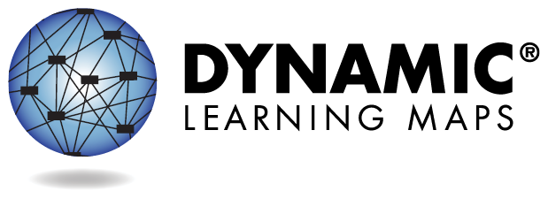

The Dynamic Learning Maps&reg; (DLM&reg;) Alternate Assessment System Consortium is made up of a collection of state departments of education developing and using the DLM alternate assessments. The assessments measure student achievement in English language arts, mathematics, and science for the students with the most significant cognitive disabilities. As described in the annual [technical manual](https://dynamiclearningmaps.org/publications):

> The purpose of the DLM system is to improve academic experiences and outcomes for students with the most significant cognitive disabilities by setting high and actionable academic expectations and providing appropriate and effective supports to educators. Results from the DLM alternate assessment are intended to support interpretations about what students know and are able to do and to support inferences about student achievement in the given subject. Results provide information that can guide instructional decisions as well as information for use with state accountability programs.
>
> The DLM Alternate Assessment System is based on the core belief that all students should have access to challenging, grade-level content. Online DLM assessments give students with the most significant cognitive disabilities opportunities to demonstrate what they know in ways that traditional paper-and-pencil, multiple-choice assessments cannot. The DLM alternate assessment is designed to map students’ learning throughout the year, using testlets that are embedded in day-to-day instruction. In this way, assessment happens as part of instruction, which both informs teaching and benefits students. A spring assessment is also administered, and cumulative results for the entire year are reported for state accountability purposes and programs.
